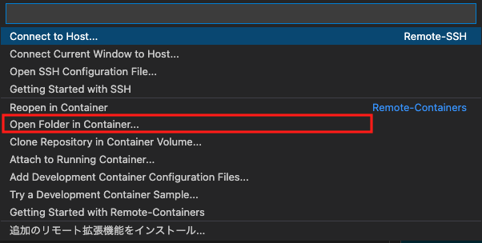

# PYTHON-FILE-IO

## 概要

- Python を用いてファイルの入出力
  - Binance 取引所での仮想通貨の取引記録を Excel ファイルとして export できるので、ここではその Excel ファイルを扱った
- 処理内容
  - ほぼ同時に複数の約定が起こり取引記録が複数に分裂することが多々起こるため、それらの取引履歴を一つにまとめる

## 目的

- 書いたことがない Python を使ってみる
- 実用的な File I/O ロジックを作る
  - 今回作成した処理は今後の仮想通貨投資の経理処理で充分使っていけるものである
- コンテナでの環境構築練習
  - コンテナ内で実行・デバッグの環境を整える

## 使用技術

|                   | バージョン | memo                                                                         |
| ----------------- | ---------- | ---------------------------------------------------------------------------- |
| Python            | 3.10.4     |                                                                              |
| OpenPyXL          | 3.0.9      | Excel ファイルを Python で扱うためのパッケージ                               |
| Docker            | 20.10.11   |                                                                              |
| docker-compose    | 1.29.2     |                                                                              |
| Remote Containers | 0.234.0    | VScode 拡張。コンテナ内で VScode を動作させる(?)。デバッグなどの目的で導入。 |

## 使い方

1. /input に操作対象の Excel ファイル(Binance 取引所の取引履歴ファイル)を配置
   - docker-compose.yml でマウントしている
1. Remote Development(ms-vscode-remote.vscode-remote-extensionpack) を VScode にインストール
1. Remote Development でコンテナに入る
   - 
   ***
   - 
   ***
   - 
1. sample.py を開き実行することで/output に出力される

- MEMO
  - 複数ファイルに対応している
  - 同名のファイルが既に/output に存在する場合は上書きされる(delete&create)

## 解決したかった問題と対処まで

### 問題: 仮想通貨の取引記録が複数に分裂することが多々起こる

- 例: 1000\$の指値で通貨 XXX を 500\$分購入
  - 取引 1: 取引価額[1000$]　取引ペア[XXXUSDT]　取引数量[200\$分]
  - 取引 2: 取引価額[1000$]　取引ペア[XXXUSDT]　取引数量[30\$分]
  - 取引 3: 取引価額[1000$]　取引ペア[XXXUSDT]　取引数量[50\$分]
  - 取引 4: 取引価額[1000$]　取引ペア[XXXUSDT]　取引数量[220\$分]
- 上記のように、売りたい人の発注数量により取引数量が決まるので取引が複数に分裂する
- これだと取引記録が見づらい上に、取引計算サービスにアップロードする際に取引数が大幅に増え、より高額なプランに変更する必要があり困っていた

#### 対処: Python と OpenPyXL を使用し、同一発注分の取引記録をとりまとめる

- Excel 操作でよく使われる Python を言語に選択
  - VBA を用いることも考えたが、Excel しか使えない言語より Python などメジャーな言語を扱うほうが後の汎用性が高いと判断
- ライブラリを調査し、一番メジャーと思われる OpenPyXL を選択
  - メジャーなライブラリであれば資料も探しやすいため

### 問題: 環境を汚したくない

- 今まで Node.js のバージョン管理に nvm などを利用したりしてきて、同じような仕組みは Python にもあると思われるが煩雑 & PC を買い替えたあとなどの環境の再構築が面倒なイメージがあった

#### 対処: Docker で環境構築

- これまで何度か Docker で環境構築をしてきたので Python でも問題なくできた

### 問題: ローカル環境の VScode で Python のデバッグができない

- ローカルには OpenPyXL などをインストールしていないため VScode のデバッグ起動時にエラーとなっていた

#### 対処: VScode 拡張の Remote Containers を使用しコンテナ内で直接デバッグ

- Remote Containers の設定方法を学び、コンテナ内で作業することでデバッグ環境を整えた
- 初めて導入してみたが、以下の点で有用だと感じた
  - **ローカルの VScode に拡張機能をインストールしたり個別の設定を弄る必要がない**
    - 複数の PJ を兼任することが多いので、PJ を切り替えるたびに拡張機能や設定を意識するのが面倒だった
      - 特に Formatter の設定有無は PJ によってまちまちで、切り替えを忘れると保存時にコードの体裁がごっそり変わってしまったりして面倒に感じていた
    - **設定ファイルを git 管理しておけば各メンバーの拡張機能 や VScode 設定を統一することができる**のでテキストベースで設定のいじり方や導入すべき拡張機能などを書かなくてよくなりそう(今まで頑張って書いてきたが、今後はこの方法で不要にしたい。)
